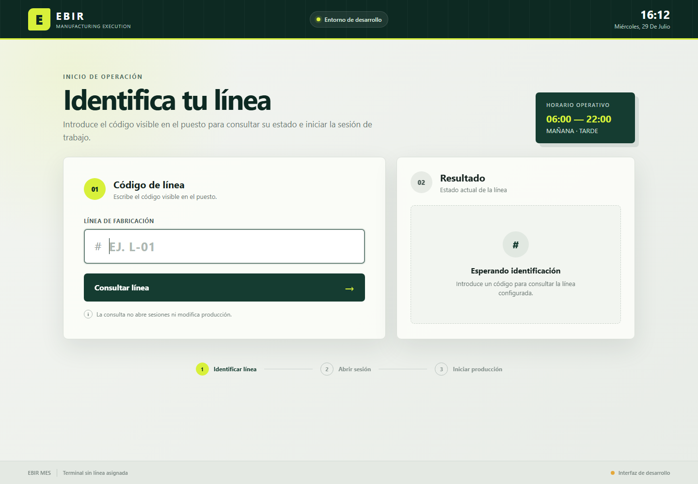

# EBIR MES

Sistema de ejecución de fabricación de EBIR para operación en planta:
identificación de línea, sesiones y turnos, fichajes, producción, paletización,
scrap, reaprovisionamiento, impresión e integración controlada con NAV.

## Estado

La base `EBIR_MES_TEST` contiene los paquetes SQL 001–013 instalados y
validados. La estructura de aplicación es un monolito modular .NET con una
interfaz React. La primera vertical, `LineIdentification`, ya dispone de caso
de uso, consulta parametrizada, API, interfaz y pruebas sin haber ejecutado SQL
durante su implementación. El backend Node/Express de exploración y los
prototipos anteriores se conservan en `legacy-reference`; no forman parte de la
nueva aplicación.

## Estructura

- `docs`: arquitectura, reglas y documentación por módulo.
- `src/backend`: API, aplicación, dominio, infraestructura, integraciones y
  worker.
- `src/frontend`: interfaz React organizada por funcionalidad.
- `tests`: pruebas de backend, frontend y base de datos.
- `database`: paquetes SQL versionados.
- `scripts`: automatización local y de CI.
- `deploy`: documentación y artefactos de despliegue.
- `runtime`: despliegues y estado operativo del servidor; generado e ignorado
  por Git.
- `legacy-reference`: material de descubrimiento y código anterior, solo como
  referencia.

El código vive exclusivamente en las carpetas versionadas. En
`MES.EBIR.LOCAL`, toda la parte mutable se agrupa bajo:

```text
runtime/
├── bootstrap/          # página temporal de IIS
├── current/            # versión activa cuando exista un despliegue
├── releases/           # publicaciones versionadas
└── shared/
    ├── config/
    ├── data/
    ├── logs/
    └── temp/
```

El punto de entrada para cualquier cambio es
[`docs/functional-map.md`](docs/functional-map.md).

## Primera vista

La identificación real de línea ya está implementada y compilada. La conexión
de entorno sigue pendiente de configuración y autorización:



## Requisitos de desarrollo

- .NET SDK 10.0.302.
- Node.js 22 o superior.
- npm 10 o superior.
- Acceso a SQL Server solo cuando la fase esté expresamente autorizada.

## Arranque de desarrollo

API, en una consola:

```powershell
Set-Location C:\MES
dotnet run --project .\src\backend\Ebir.Mes.Api
```

Interfaz, en otra consola:

```powershell
Set-Location C:\MES\src\frontend
npm ci --include=dev
npm run dev
```

El proxy de Vite dirige `/api` a `http://127.0.0.1:5080`, que coincide con el
perfil HTTP del backend. Sin `ConnectionStrings__MesDatabase`, la API arranca y
los endpoints de salud funcionan, pero la identificación responde de forma
segura con HTTP 503. La configuración sensible se suministrará mediante
variables de entorno o el almacén de secretos del servidor, nunca mediante
archivos versionados.

En `MES.EBIR.LOCAL`, `NODE_ENV` está fijado a `production`; por eso el arranque
de desarrollo usa `--include=dev`.
